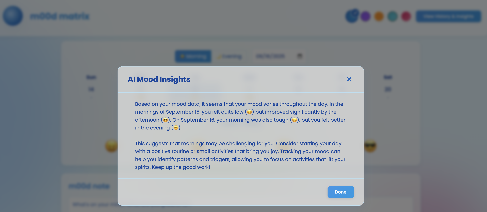

# m00d matrix


*Image from: [https://www.calm.com/blog/mood-monitoring](https://www.calm.com/blog/mood-monitoring)*

-----

### Mood Tracking: Your Secret Weapon for a Healthier Mind

Mood tracking is a simple but powerful tool for boosting your mental health. By regularly recording your emotions, you can gain self-awareness, identify patterns, and make positive changes in your life. This practice is a core component of **Cognitive Behavioral Therapy (CBT)**, which teaches you to understand the links between your thoughts, feelings, and actions.

-----

## What is Mood Tracking?

Mood tracking is the practice of observing and recording your emotional state over time. Think of it as keeping a log of your feelings. By consistently noting your moodslike Upset, Calm, or Very Happyyou can begin to see **patterns**. You might notice that certain activities, people, or times of day consistently trigger a specific emotional response. This process gives you valuable insights into how your thoughts and actions shape your emotional well-being.

### A Key Principle from CBT

Cognitive Behavioral Therapy (CBT) is a form of psychotherapy that focuses on the interconnected cycle of thoughts, feelings, and behaviors. Mood tracking is a perfect match for this approach because it helps you:

1.  **Build Awareness:** It makes you more mindful of your daily emotional ups and downs.
2.  **Spot Triggers:** It helps you identify the specific events or thought patterns that precede certain moods.
3.  **Encourage Action:** Once you can name your mood and understand its cause, you can begin to challenge negative thoughts or adjust your routine to support a more positive emotional state.

Seeing these patterns clearly on a chart or in a journal can help you pinpoint whats working for you and what isnt.

-----

## Why Should You Track Your Mood?

Regular mood tracking offers several key benefits that can lead to a healthier and more resilient mindset.

  * **Early Detection:** Subtle emotional shifts can often be early warning signs of bigger mental health challenges like burnout or heightened anxiety. By tracking your mood, you can catch these changes early and take action before they escalate.
  * **Gains Clarity and Perspective:** When emotions feel overwhelming, writing them down can make them feel more manageable and less daunting. This practice transforms chaotic feelings into tangible data you can examine with a sense of detachment, which promotes self-compassion.
  * **Informs Goal-Setting:** Tracking helps you set smarter, more effective personal goals. For example, if you notice you feel anxious after scrolling through social media before bed, you can set a goal to put your phone away earlier. This small change, guided by your data, can have a big impact.
  * **Measures Progress:** Over time, your entries create a personal record of your journey. You can look back at your history and see how far you've come. It also helps you measure the effectiveness of new habitslike starting a new exercise routine or practicing mindfulnessto see if they are correlated with a better mood.
  * **Communicate More Clearly:** Your mood tracker can help you express your feelings to others more effectively, whether that's a loved one, a friend, or a mental health professional.

-----

## AI Mood Insights Example




```Based on your mood data, an analysis might find that your mood varies throughout the day. For example, in the mornings of September 15, you may have felt quite low but improved significantly by the afternoon. On September 16, your morning was also tough, but you felt better in the evening.```

This suggests that mornings may be challenging for you. Consider starting your day with a positive routine or small activities that bring you joy. Tracking your mood can help you identify patterns and triggers, allowing you to focus on activities that lift your spirits. Keep up the good work.

-----

## How to Get Started

It's easy to begin mood tracking. The most important thing is to find a system that works for you and stick with it.

1.  **Choose a System:** You can use a simple paper journal, a digital spreadsheet, or a dedicated mood-tracking app like m00d matrix. Other effective methods include The Feelings Wheel, wearable devices, photo mood tracking, and voice memos. The right tool is the one you'll use consistently.
2.  **Record Consistently:** Try to log your mood at least once a day. Many people find it helpful to check in with themselves in the morning and again in the evening.
3.  **Add Context:** Don't just record the emotion; add a short note about what happened. This note is where the real insights are found. It could be about a conversation you had, a task you completed, or a physical symptom you're experiencing.
4.  **Look for Patterns:** Make time to review your logs weekly or monthly. Notice if there are recurring emotional states tied to specific people, places, or activities. This is where the magic happens.
5.  **Experiment:** Once you spot a negative pattern, try a small experiment to break it. For instance, if you notice your mood plummets after a stressful work meeting, try taking a short walk or listening to music immediately afterward.

-----

## Tips for Success

  * **Be Honest:** Don't try to sugarcoat your feelings. For the process to be useful, you must be honest with yourself, even if your mood isn't "ideal."
  * **Practice Self-Compassion:** If you spot recurring negative thoughts, treat yourself with kindness, not judgment. Youre on a journey of learning and adapting.
  * **Integrate with Therapy:** If you're working with a mental health professional, share your mood logs with them. They can help you interpret the data and create personalized coping strategies.
  * **Celebrate the Wins:** Pay attention to the positive moments, too\! Noticing and celebrating the small bright spots can keep you motivated and remind you that you're making progress.
  * **Try to Improve a Low Mood:** When you notice a dip in your mood, try simple strategies like reducing stress, engaging in enjoyable activities, getting rest, moving your body, or reaching out to a loved one.

-----

## The CBT Connection

The synergy between mood tracking and Cognitive Behavioral Therapy is a powerful blueprint for personal growth. When you use mood tracking as a part of your daily routine, you naturally develop a **habit of self-reflection**. This practice helps you build a crucial **skill in assessing** which of your thoughts are constructive and which are harmful.

Ultimately, mood tracking helps you learn how to **challenge and reframe** negative beliefs into more balanced and realistic ones. It turns a seemingly simple act of logging an emotion into a powerful tool for emotional regulation.

-----

## In Closing

Mood tracking is much more than a list of emotions. Its an investment in your mental health. Its a powerful tool for self-awareness and emotional regulation that can lead to meaningful behavioral changes.

Whether you use an app or a simple journal, each daily log adds up, giving you the clarity and insight to make impactful changes in your life. If youre new to this, just start with a week or two of consistent tracking. You'll likely be amazed at the patterns you uncover, and with a bit of curiosity and kindness, you can use those insights to shape a life that truly supports your emotional health.